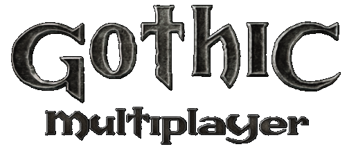

<div align="center">
  
  
  # Gothic Multiplayer
  
  [](https://github.com/Pinemarten/GothicMultiplayer)
  [](LICENSES)
</div>

## 📖 About

Gothic Multiplayer is a fan-made multiplayer modification for Gothic 2: Night of the Raven that allows players to experience the world of Gothic together. Originally released in January 2011, this project has been improved with various fixes and enhancements since 2022, but the majority of its code is still quite dated.

> **Historical Note**: To see the code close to its original 2011/2012 release state, check out the [v0.2b tagged version](https://github.com/Pinemarten/GothicMultiplayer/tree/v0.2b).

## 📋 Table of Contents
- [Prerequisites](#-prerequisites)
- [Building from Source](#-building-from-source)
- [Installation & Setup](#-installation--setup)
- [Usage](#-usage)
- [Testing](#-testing)
- [Credits](#-credits)
- [License](#-license)

## 🔧 Prerequisites

Before building or running Gothic Multiplayer, ensure you have:

### For Building
- **[xmake](https://xmake.io/)** - Modern build system and dependency manager
  - Visit the [xmake installation guide](https://xmake.io/#/guide/installation) for your platform
- **Git** - For cloning the repository
- **C++ compiler that supports C++20** - e.g., Visual Studio 2022 (Windows)

### For Running
- **Gothic 2: Night of the Raven** - Original game with 2.6 (fix) patch
  - Must be a legitimate copy of the game
  - Ensure it's properly patched to version 2.6

### Recommended Tools
- **Git Bash** (Windows users) - For better command-line experience
- **PowerShell** (Windows) - Alternative terminal option

## 🏗️ Building from Source

### 1. Clone the Repository
```bash
git clone https://github.com/Pinemarten/GothicMultiplayer.git
cd GothicMultiplayer
```

### 2. Build the Project
```bash
xmake
```

### 3. Build Specific Components (Optional)
```bash
# Build only the launcher
xmake build GMPLauncher

# Build server only
xmake build GMP_Serv

# Build client only  
xmake build GMP_Client
```

## 🚀 Installation & Setup

### 1. Install to Gothic 2 Directory
Replace the path below with your actual Gothic 2: Night of the Raven installation directory:

```bash
xmake install -o "C:\Program Files (x86)\Gothic II"
```

**Common Installation Paths:**
- Steam: `C:\Program Files (x86)\Steam\steamapps\common\Gothic II`
- GOG: `C:\GOG Games\Gothic II Gold`
- Retail: `C:\Program Files (x86)\Gothic II`

### 2. Verify Installation
After installation, you should find:
- **Server**: `[Gothic2Directory]\GMP_Server\` - Contains server executable and config files
- **Client Launcher**: `[Gothic2Directory]\system\GMPLauncher.exe` - Main launcher for the client

## 🎮 Usage

### Starting the Server
1. Navigate to your Gothic 2 installation directory
2. Go to the `GMP_Server` folder
3. Configure server settings in the provided configuration files
4. Run the server executable

### Starting the Client
1. Navigate to `[Gothic2Directory]\system\`
2. Launch `GMPLauncher.exe`
3. Connect to a server that you previously started.

## 🧪 Testing

Run the test suite to ensure everything is working correctly:

```bash
xmake test
```

This will build and execute all test cases.

## 🙏 Credits

- **Gothic Multiplayer Team**: pampi, skejt23, mecio - Original development
- **Current contributors**: Continued development and improvements since 2022
- **G2ext Headers**: Paindevs and Patrick Vogel ([g2ext repository](https://github.com/DaDummy/g2ext))

## 📄 License

This project uses a MIT license for its main code. Please see the [LICENSES](LICENSES) file for details.
